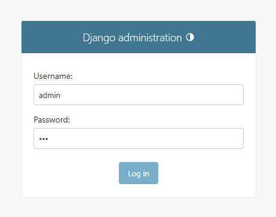
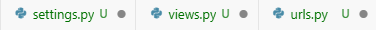
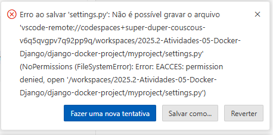
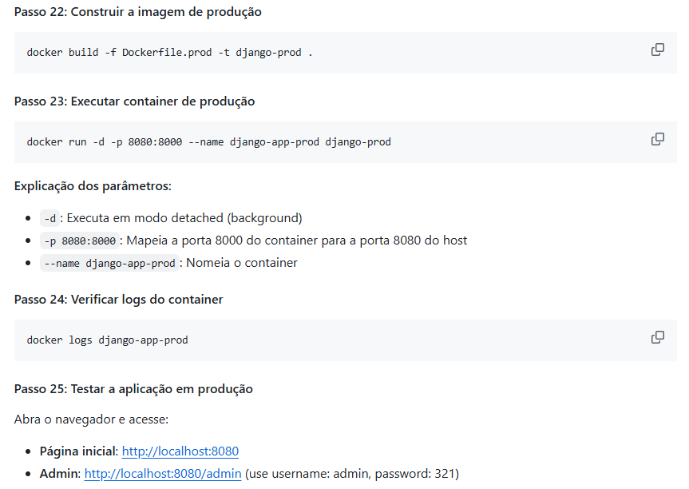
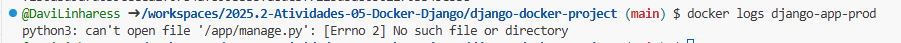
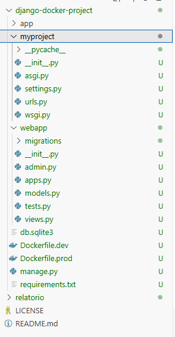

# Relatório da Atividade 05 - Sistemas Operacionais

## Resultado:

Consegui realizar boa parte dos comandos, até chegar na parte de acessar o admin.

Tenho acesso até esta página, porém ao acessar, da erro chamado "Forbidden".
Realizei todas as instruções anteriores, apaguei e refiz o ambiente virtual 3x para ver se o problema estava aqui, mas nada dava certo para esse erro sair.

Além disso, outro erro que acontecia era de eu não conseguir salvar as alterações nos arquivos. Ex: Arquivos mexidos na Views, urls, settings, etc não eram salvos e dava um erro em que eu nao conseguia resolver:

Acredito eu, que por não conseguir salvar as alterações nos arquivos, o erro "Forbidden" continua persistindo.

Mesmo assim, continuei na atividade, ate chegar nos passos 22 - 25:

Consegui Rodar o Passo 22 e 23, mas ao chegar no passo 24, aparece o seguinte erro no Terminal:

Comprovando que os arquivos não estão sendo salvos como deveriam estar.

Atuallmente, o Codespaces encontra-se da seguinte forma:

Mesmo com a criação de todos os arquivos recomendados, não consegui concluir a atividade como o esperado, pois os arquivos não estão salvando. :(